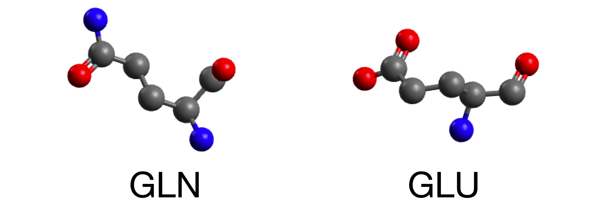

# Amino Acid Classification

This project focuses on the classification of amino acids using a Convolutional Neural Network (CNN). The dataset is derived from Protein Data Bank (PDB) files, which contain detailed information about the 3D structures of proteins and nucleic acids. The model is trained to predict the type of amino acid based on atomic coordinates and elements, leveraging the spatial relationships between atoms to make accurate classifications. In a second step, we exclude the element information to simulate more realistic use-cases and analyze how this affects the model's performance, particularly in distinguishing amino acids with similar atomic arrangements but different element types in key positions.

Amino acids are the building blocks of proteins, and their classification is crucial for understanding protein structure and function. Each amino acid has unique properties that influence how it interacts with other molecules. In the simplest terms, they can be described by a set of 3D coordinates of their atoms and the corresponding elements. Accurate classification can aid in various biological and medical research areas, including drug design and protein engineering.

Convolutional Neural Networks (CNNs) are a class of deep learning models particularly well-suited for spatial data. By applying convolutional layers, the model can capture local patterns and hierarchical features, making it effective for tasks involving structured data like the atomic coordinates of amino acids. This project demonstrates the application of CNNs to classifying amino acid coordinates, showcasing their versatility and power in bioinformatics.

While this project primarily serves as an example of using CNNs with high-dimensional data, potential applications of a pretrained model include assigning amino acid residues to electron density maps derived from X-ray crystallography or cryo-EM data. 

## Notebooks

### [01_data.ipynb](01_data.ipynb)

This notebook focuses on data extraction and preprocessing.

#### Key Sections:

1. **Extracting Amino Acids**
    - Download PDB files from the PDB
    - Extract amino acids from PDB files.
    - Filter and clean the data.
    - Extract resolution data

2. **Saving Processed Data**
    - Save the processed data to new PDB files containing amino acids only.
    - Center amino acids and add augmentation to the dataset

### [02_coord_and_element.ipynb](02_coord_and_element.ipynb)

This notebook shows the training process and dataset for a model that gets information of 3D coordinates and heavy atom elements.

#### Key Sections:

1. **Data Loading and Preprocessing**
    - Load the amino acid dataset from PDB files.
    - Preprocess the data by extracting residues and augmenting the dataset with rotations.
    - Split the data into training, validation, and test sets.

2. **Model Definition**
    - Define the `AminoAcidCNN` model architecture.
    - Implement data augmentation techniques.

3. **Training the Model**
    - Train the model using the training dataset.
    - Fine-tune the pretrained model for additional epochs.
    - Implement early stopping and learning rate scheduling.

4. **Evaluation**
    - Evaluate the model's performance on the test dataset.
    - Plot the training loss and accuracy.
    - Generate confusion matrices and classification reports.

5. **Visualization**
    - Visualize the results, including the model's predictions and the actual labels.
    - Plot 3D structures of correctly and incorrectly classified amino acids.

### [03_coord_only.ipynb](03_coord_only.ipynb)

Training a CNN model to recognize amino acids based only on a set of 3D coordinates. This is a bit of a harder problem since there is now several residues that can have the same arangement of heavy atoms in 3D, only differentiating in the elements that bond and therefore exhibiting only different bond lengths and angles. These include for example Glutamate and Gluatamine, but also Aspartate and Asparagine and Leucine.



## Usage

### Requirements

- Python 3.8+
- GPU with CUDA support (recommended for training, e.g., Google Colab for free)
- All other dependencies are listed in `environment.yml`

### Running the Notebooks

1. Clone the repository.
2. Install the required packages using the `environment.yml` file:
    ```bash
    conda env create -f environment.yml
    conda activate amino_acid_classifier
    ```
3. Open the notebooks in Jupyter and run the cells sequentially.

### Training the Model

To train the model, run the cells in [02_coord_and_element.ipynb](02_coord_and_element.ipynb) or [03_coord_only.ipynb](03_coord_only.ipynb). The training process includes data loading, model definition, training, and evaluation.

### Evaluating the Model

After training, evaluate the model's performance using the test dataset. The evaluation metrics and visualizations are provided in the notebooks.

## Try it on Binder

You can try out the notebooks using Binder. Click the link below to launch the notebooks in an interactive environment:

[](https://mybinder.org/v2/gh/tobias/AminoAcidClassifier/HEAD)

## License

This project is licensed under the MIT License.

---

For more details, refer to the individual notebooks and the code comments.
